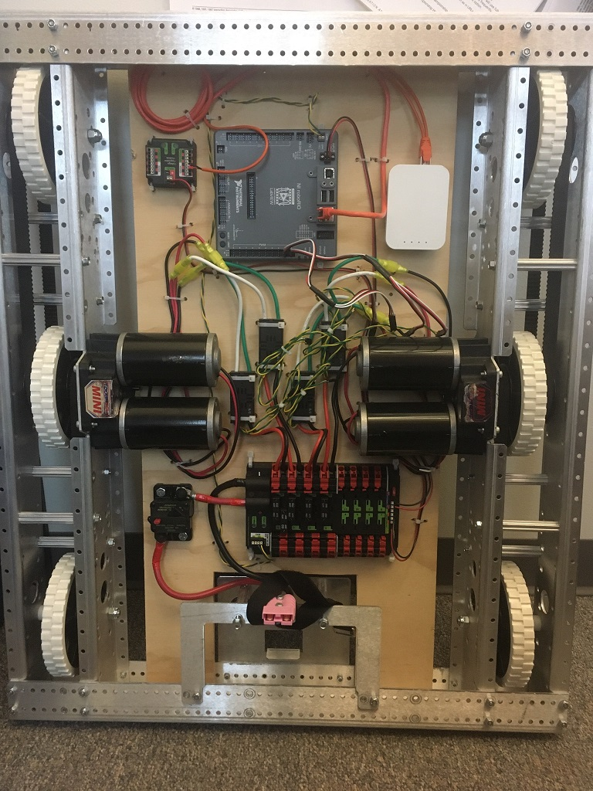

# SimRobot

Very basic robot using the WpiLib Simulation for drivetrain.  Useful for starting and working on autonomous commands.

## Initialization

For this robot, we are going to assume that we are using the KitBot chassis (the AndyMark AM14U4).  While this will work for basic driving, we probably initialize the drivetrain with more reasonable parameters.  This robot feels light, but reasonable to start.

Image (from [WpiLib](https://docs.wpilib.org/en/stable/docs/zero-to-robot/step-1/how-to-wire-a-robot.html), accessed June 2021)

For our virtual robot, we are going to "wire" up the robot like this:

* Left CIM Motors, Victor SP, PWM Channel 1
* Right CIM Motors, Victor SP, PWM Channel 2
* Left Encoder, Digital In Channels 1 & 2
* Right Encoder, Digital In Channels 3 & 4
* Gyro, Assuming a ADXRS450, which came in the kit multiple years, plugs into SPI port on RoboRio, and has no "port" to configure (as you can only plug in one)

The main reason these parts were picked were A) They are the basic parts that a new team would have, B) They use standard WpiLib objects, so the WpiLib simulation can emulate them easily.  3rd party libraries require support from the suppliers to make simulated objects, and I didn't want to bother with this example.  

Notes:

* Looking at the picture, these are Victor SPX, but they are using a Y-PWM cable to make sure both motors get the exact same command to not tear up a gearbox.
* Traditionally, teams 2832/6861 uses the encoder modes built into Talon SRX speed controllers, but we are going to use the easy digital IO for this example.  Also, looking at the picture, there are no encoders on this kit robot.  They would go on the little shaft you see on the left side, between the CIM motors, using a E4T OEM Encoder Kit.
* Also traditionally, teams 2832/6861 use the Pigeon IMU, which can plug into a Talon SRX and connect via CAN.  The main advantage with an external IMU/Gyro like this is it can be put closer to the center of rotation of the robot.
